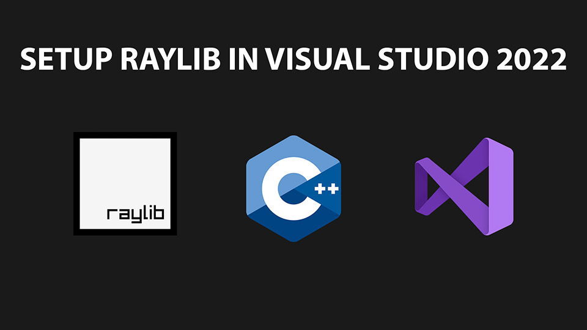

# Raylib Starter Template

Setup raylib with C++ in Visual Studio 2022 Community edition.  <a href="https://youtu.be/UiZGTIYld1M">In this tutorial</a>, I guide you through the quick and easy process of setting up raylib on your Windows computer and integrating it with C++ and Visual Studio. In just 10 minutes, you'll be ready to start using raylib to create exciting games.

# Video Tutorial

  

🎥 <a href="https://youtu.be/UiZGTIYld1M">Video Tutorial on YouTube</a>

 
 

| 📺 <a href="https://www.youtube.com/channel/UC3ivOTE5EgpmF2DHLBmWIWg">My YouTube Channel</a>
| 🌍 <a href="http://www.educ8s.tv">My Website</a> |  

